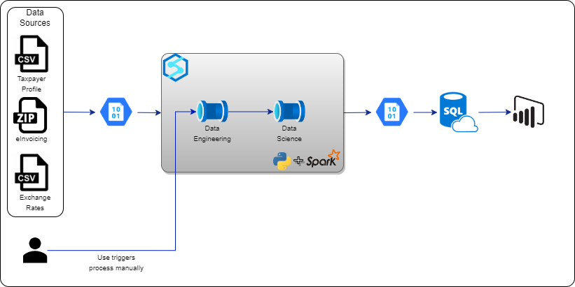
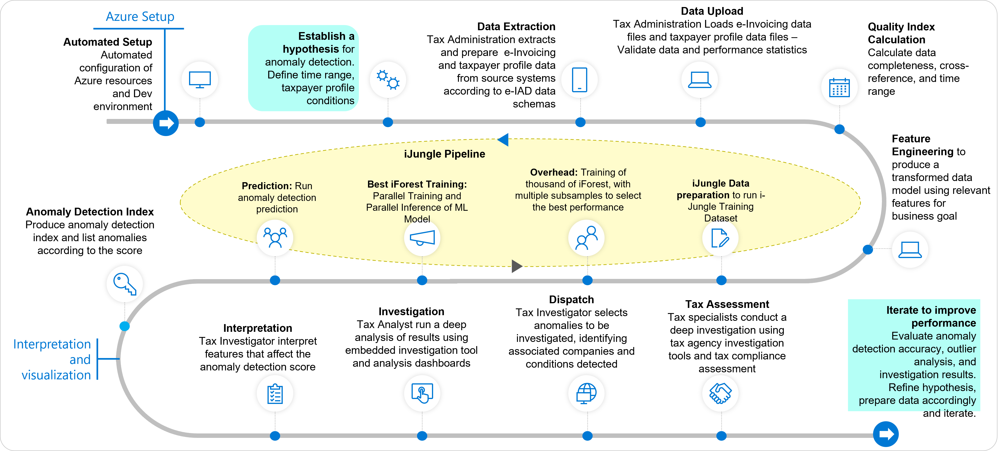

# e-IAD, version 1.0 (Electronic Invoice Anomaly Detector)

## Introduction

e-IAD 1.0 (electronic Invoicing Anomaly Detection) has been designed and built to leverage the latest AI/ML to provide Automated detection of anomalies in e-Invoicing data. The e-IAD capabilities can be applied to any e-Invoicing or equivalent sales document for B2B transactions, collected by a tax administration by using a predefined data schema.

e-IAD 1.0 builds on the expert knowledge of business representatives from Tax Agencies represented by the Interamerican Center of Tax Administrations - CIAT. e-IAD 1.0 is provided to customers and to partners as a Microsoft Industry Accelerator at no charge to accelerate their “time to value” on Azure.

These capabilities can be applicable to Industry Use Cases like:

- Reduce data processing complexity for analytics to detect anomalies quickly and solve problems faster.
- Measure e-Invoicing data quality with a rapid e-Invoicing analysis that helps tax agencies identify policy gaps in collecting e-Invoicing documents.
- Represent B2B commercial transactions in the economy, that help tax agencies to describe and analyze issuing patterns and commercial behaviors.
- Detect e-Invoicing anomalies in the tax agency's interest to identify issuing errors requiring taxpayer correction, detect unexpected issuing patterns, or detect issuing operations requiring further investigation for potential incorrect taxpayer conduct.
- Provide an anomaly index and score to increase productivity and intelligence of the tax agency investigation department.

e-IAD, version 1.0, provides these key capabilities:

- Standardized e-Invoicing and taxpayer-profile data schemas. PII data not supported.
- Data Quality Index to assess the quality of ingested data
- Fully automated Unsupervised ML Pipeline designed for e-Invoicing data
- More than 50 features engineered from risk e-Invoicing patterns
- Ability to create or shipped with example dashboards to show how data can be interpreted
- Anomaly detection Index to facilitate prioritization of detected anomalies
- Interpretation of features that influence the anomaly index
- Embedded interactive tool to do a deep analysis of  data

---

## Responsible AI

The e-IAD Accelerator and Microsoft are committed to the advancement of AI driven by ethical principles that put people first. Read our [Transparency Note](./docs/transparency.md)

Find out more with Microsoft's [Responsible AI resources](https://www.microsoft.com/en-us/ai/responsible-ai)

---

## High Level Architecture

## e-IAD, version 1.0 Workflow

e-IAD, version 1.0, is composed of Microsoft components and Open-Source Software (OSS) and is provided to customers and partners at no charge.  

The components of this accelerator include:

- Custom configuration code
- Deployment kit
- Cost calculator
- Documentation

This accelerator is designed to accelerate the “time to value” in using the Microsoft components. As an accelerator, is it not for sale, nor is it a supported product.  

A full set of features can be explored on our [Features](docs/features/features.md) page.

---

## Getting Started

### Pre-requisites

e-IAD, version 1.0, requires a variety of services across Azure. There are a few prerequisites required to deploy and configure e-IAD, version 1.0. Please obtain these items first before continuing on to the deployment section of this guide.

>To get started with e-IAD, version 1.0, you will need the following:
>
>- An active Azure Subscription
>- Administrative rights on the Azure Subscription
>- Power BI Workspace

You can sign up for an Azure subscription [here](https://azure.microsoft.com/en-us/free/).

Once you have your prerequisite items, please move on to the Deployment Configuration step.

---

## Deployment Configuration

>You will also need some development tools to edit and run the deployment scripts provided. It is recommended you use the following:
>
>- A windows based computer (local or cloud)
>- [Visual Studio Code](https://visualstudio.microsoft.com/downloads/)
>- [Docker Desktop](https://www.docker.com/products/docker-desktop)
>- [Windows Store Ubuntu 20.04 LTS](https://www.microsoft.com/store/productId/9MTTCL66CPXJ)
>- [Power BI Desktop](https://apps.microsoft.com/store/detail/power-bi-desktop/9ntxr16hnw1t)
>- [Git for Windows](https://gitforwindows.org/)

The deployment process for e-IAD, version 1.0, uses a concept of **Developing inside a Container** to containerize all the necessary pre-requisite component without requiring them to be installed on the local machine. Follow our [Configuring your System for Development Containers](docs/developing_inside_a_container.md) guide.

*More information can be found at [Developing inside a Container](https://code.visualstudio.com/docs/remote/containers).*

Once you have the prerequisites completed, please move on to the Sizing Estimation step.

---

## Cost Estimator

e-IAD, version 1.0, needs to be sized appropriately based on your use case. Please review our [Cost Estimator](docs/costestimator.md) to help find the configuration that fits your needs.

Once you have completed the Cost Estimator, please move on to the Deployment steps.

---

## Deployment

There are a few steps to deploying e-IAD, version 1.0. The following checklist will guide you through configuring e-IAD, version 1.0 in your environment. Please follow the steps in the order they are provided as values from one step may be used in subsequent steps.

>1. Configure Local Development Environment
>       - [Configuring your Development Environment for e-IAD](docs/development_environment.md)
>2. Configure Azure resources
>       - [Configure Azure resources](infrastructure%2FREADME.md)
>3. Run a functional test
>       - [Run Functional Test](tests/FUNCTIONAL_TESTING.md)
>4. Configure Power BI
>       - [Deploy Power BI Report](powerbi/POWERBI.md)

Once all these steps are completed, e-IAD, version 1.0, is ready to be used. Please move on to the Using e-IAD for the first time section.

## Using e-IAD for the first time

---

Now that you have successfully deployed e-IAD, version 1.0, You are ready to use the accelerator to process some data.

To run the e-IAD Accelerator, you need to follow these steps:

> 1. Prepare your data and upload it to Azure.
>       - Your data must be in a specified format to be valid for processing. See our [input data schema specification](/docs/inputdataschema.md).
>       - Upload your data into the input container using the [data upload specification](/docs/datauploadspec.md).
> 2. Once uploaded you can then run the Azure Synapse Pipeline to process your data.
>       - Next you need to [tune the hyperparameters](/docs/hyperparameters.md) for your data
>       - Finally, follow our [Running your first batch](/docs/runningfirstbatch.md) guide.

For more detailed information review the [Features](docs%2Ffeatures%2Ffeatures.md) section of e-IAD, version 1.0.

---

## Navigating the Source Code

This project has the following structure:

Folder/File | Description
--- | ---
docs/ | General Documentation for the Accelerator
infrastructure/ | The terraform scripts used to manage the infrastructure.
pipelines/ | The CI/CD pipelines for the Accelerator
powerbi/ | The Power BI files used in the deployment
scripts/ | The shell scripts and unit test for the Accelerator
synapse/ | Configuration and Jupyter notebooks examples of enrichments
test/ | Functional and Performance tests and framework
Makefile | The launch point for deploying the Accelerator

---

## Contributing

This project welcomes contributions and suggestions.  Most contributions require you to agree to a
Contributor License Agreement (CLA) declaring that you have the right to, and actually do, grant us
the rights to use your contribution. For details, visit <https://cla.opensource.microsoft.com>.

When you submit a pull request, a CLA bot will automatically determine whether you need to provide
a CLA and decorate the PR appropriately (e.g., status check, comment). Simply follow the instructions
provided by the bot. You will only need to do this once across all repos using our CLA.

This project has adopted the [Microsoft Open Source Code of Conduct](https://opensource.microsoft.com/codeofconduct/).
For more information see the [Code of Conduct FAQ](https://opensource.microsoft.com/codeofconduct/faq/) or
contact [opencode@microsoft.com](mailto:opencode@microsoft.com) with any additional questions or comments.

## Trademarks

This project may contain trademarks or logos for projects, products, or services. Authorized use of Microsoft trademarks or logos is subject to and must follow [Microsoft's Trademark & Brand Guidelines](https://www.microsoft.com/en-us/legal/intellectualproperty/trademarks/usage/general).Use of Microsoft trademarks or logos in modified versions of this project must not cause confusion or imply Microsoft sponsorship. Any use of third-party trademarks or logos are subject to those third-party's policies.
