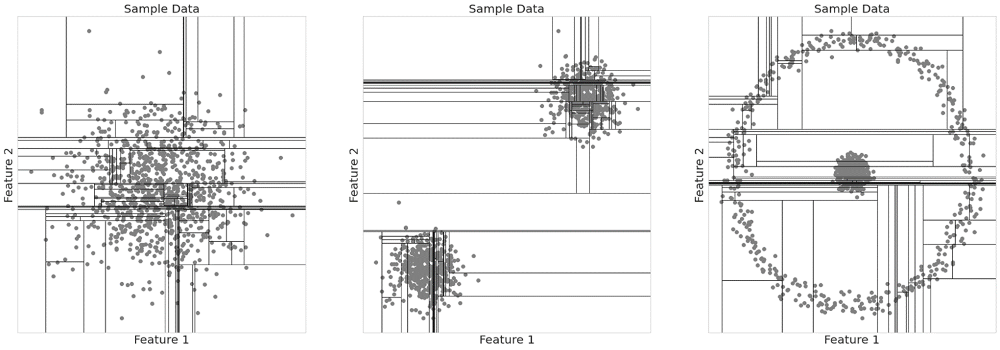

# Anomaly Detection

The e-IAD Accelerator uses an Isolation Jungle tool from Microsoft named [iJungle](https://github.com/microsoft/dstoolkit-anomaly-detection-ijungle). IJungle is part of the Data Science Toolkit.

An overview of Isolation Jungle

>- An Isolation Jungle (iJungle) is a set of many (dozens to thousands) Isolation Forests trained on a dataset with different hyperparameters.
>- The iJungle method chooses the most representative Isolation Forest among the collection of Isolation Forests as the anomaly detection algorithm.
>- For each data point, iJungle measures an anomaly score, as well as specific contribution amounts from the features that contributed the most to that anomaly score.

## Isolation Forest Overview

>- An Isolation Forest is the unsupervised variant of the Random Forest classification algorithm.
>- Decision Trees are fundamental components of Random Forests and Isolation Trees are fundamental components of Isolation Forests.
>- Data points that need few decisions to separate them from the whole of the data are considered anomalous.

