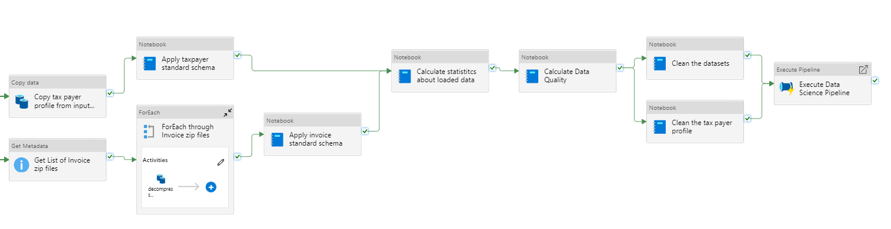
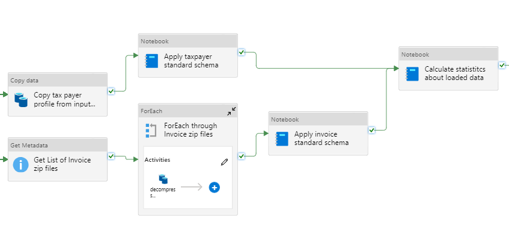
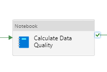
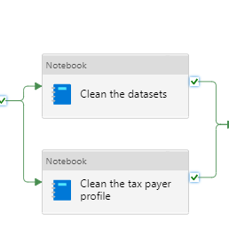

# Overview of the Data Engineering Pipeline

The Data Engineering pipeline transforms, qualifies and cleanses user submitted data to prepare it for use in the Data Science Pipeline.

The Data Engineering pipeline consists of three sections:

1. Data Loading and Statistics
    - Four data steps
    - Three Jupyter Notebooks
2. Data Quality Index
    - One Jupyter Notebook
3. Data Cleansing
    - Two Jupyter Notebooks

## Overview of the Data Loading and Statistics Section

The Data Loading and Statistics section of the pipeline makes copies of and extracts compressed input data, checks it for valid input schema, and calculates basic data metrics for the input data.

The Data Loading and Statistics section of the pipeline consists of:

## Overview of the Data Quality Index Section

The Data Quality Index section of the pipeline examines the key attributes of the dataset for completeness, ratios of null values for data elements, and checks for cross reference integrity between eInvoicing records and taxpayer profiles.

The Data Quality Index section of the pipeline consists of:

## Overview of the Data Cleansing Section

The Data Cleansing section of the pipeline replaces missing or invalid data with moniker values that will allow the Data Science Pipeline to process the data without errors for missing or invalid data.

The Data Cleansing section of the pipeline consists of:

