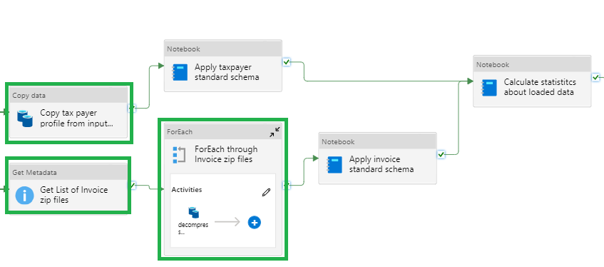
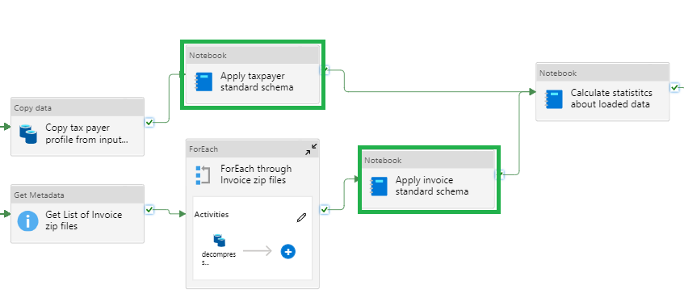
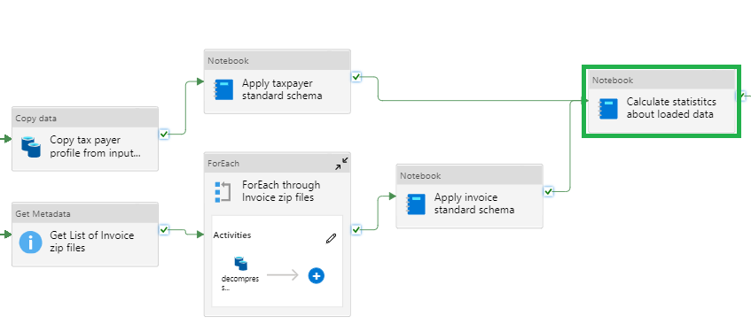

# Data Loading and Statistics

The data loading and statistics portion of the data engineering pipeline has three key parts:

1. Load and extract the provided data
2. Validate the provided data has valid schema
3. Calculate basic pre-transformation statistics on the dataset

## Load and Extract the Data

The load and extract steps in the data engineering pipeline are focused on making a copy of the provided data for validation and the ability to explain the AI outputs and to decompress the e-Invoicing data.

These steps manipulate the data and store all transformations in the "working" container in the Azure Storage Account with a name like "eiaddataxxxxx".

## Validate the data schema

The next step is to validate the schema of the provided data files matches the expected schemas. The notebook attempt to load the data, query for known column names, and apply type conversions to ensure the columns are properly types.

More information on valid data schemas can be found [here](../inputdataschema.md)

## Calculate pre-transformation statistics

The final step in this section is to calculate some basic statistics before the data has been transformed. Some examples of the types of statistics are:

>- Count of e-Invoicing documents by document type
>- Total and distinct count of issuers, receivers, and other taxpayer metrics

The statistics can be found in the "output" container in the Azure Storage Account with a name like "eiaddataxxxxx".
