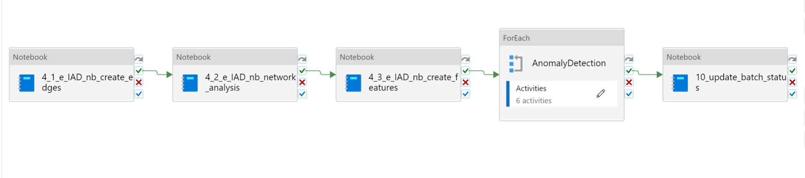

# Overview of the Data Science Pipeline

The Data Science pipeline transforms cleaned data into features suitable for anomaly detection, trains iJungle unsupervised anomaly detection models and calculates which data points are anomalous.

The Data Science pipeline consists of three sections:

1. Feature engineering
    - Three Jupyter Notebooks
2. Anomaly Detection
    - Six Jupyter Notebooks
3. Batch Status Update
    - One Jupyter Notebook

## Overview of the Feature Engineering Section

The Feature Engineering section of the pipeline calculates more than 90 features across six different time frames (year, quarter, month, week, day, and hour) to aid in detecting anomalous transactions, including features calculated from the transaction graph as well as features suggested by Subject Matter Experts.

The Feature Engineering section of the pipeline consists of three Jupyter notebooks:

1. 4_1_e_IAD_nb_create_edges.ipynb
2. 4_2_e_IAD_nb_network_analysis.ipynb
3. 4_3_e_IAD_nb_create_feature.ipynb

## Overview of the Anomaly Detection Section

The Anomaly Detection pipeline trains dozens to hundreds of unsupervised Isolation Forest models in an iJungle. The pipeline chooses the best model and uses that model to predict anomalies.

The Anomaly Detection section of the pipeline consists of six Jupyter notebooks:

1. 5_1_ijungle_common_feature_engineering.ipynb
2. 5_2_ijungle_training_iforest.ipynb
3. 5_3_ijungle_training_overhead.ipynb
4. 5_4_ijungle_training_best_iforest.ipynb
5. 5_5_ijungle_predict_anomaly_detection.ipynb
6. 5_6_ijungle_predict_interpret.ipynb
