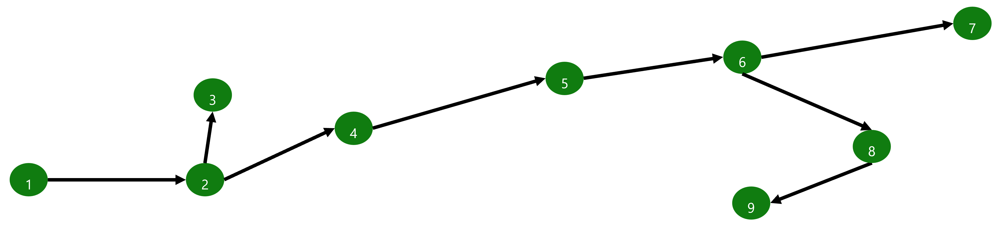
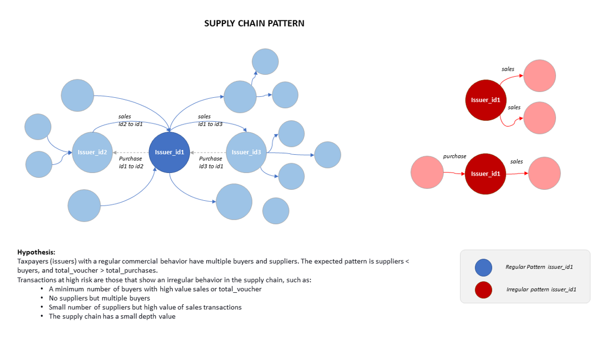
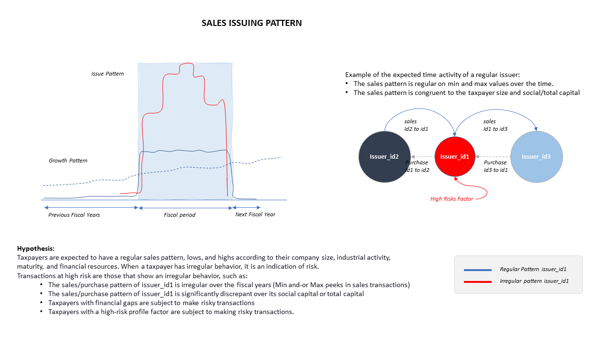
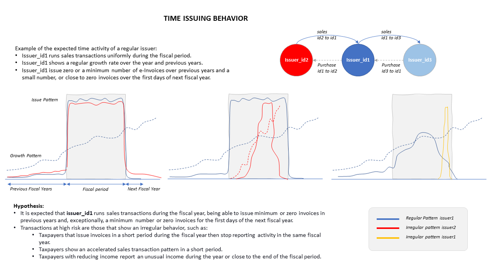
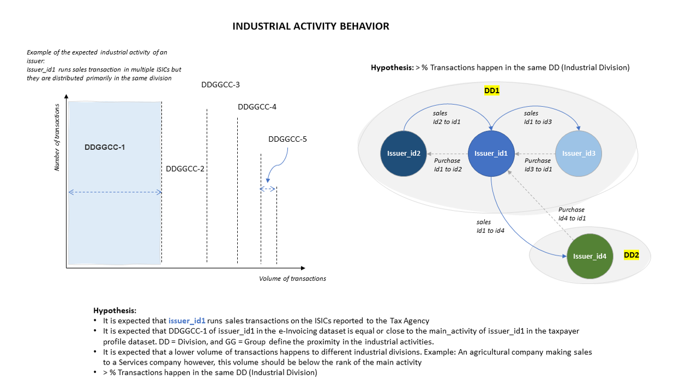

# Feature Engineering and Graph Analysis

Within the Data Science pipeline the [4_3_e_IAD_nb_create_features.ipynb](../../synapse/notebook/4_3_e_IAD_nb_create_features.ipynb) notebook calculates more than 90 features by issuer id for six different time frames including:

- By Year
- By Quarter
- By Month
- By Week
- By Day
- By Hour

## Feature Examples

Some examples of the types of features include:

### Totals by time period

> Total sales, total purchases, totals of each document type, number of distinct receivers, number of days with transactions during period

### Ratios

> Ratio of sales to purchase, ratio of tax to sales, ratio of buyers to suppliers

### Subject matter expert suggestions

>Minimum total voucher, Maximum total voucher, Monthly total buyers, Monthly total suppliers, Average monthly tax

### Graph Analysis

Specific features related to the network of transactions are created via Graph Analysis, including custom features that measure the Depth of Supply Chain.

#### Features include

>- Max length of supply chain: Nodes 1,2,4,5,6,8,9: 6; Node 3: 2, Node: 7: 6
>- Place in supply chain: 1:0, 2:1/6, 3: 2/2, 4: 2/6: 5: 3/6, 6: 4/6, 7: 5/5, 8: 5/6, 9: 6/6
>- Min length of supply chain, Distance from start, Distance from end
>- Pagerank Score for issuer importance/influence

#### Pattern Diagrams

