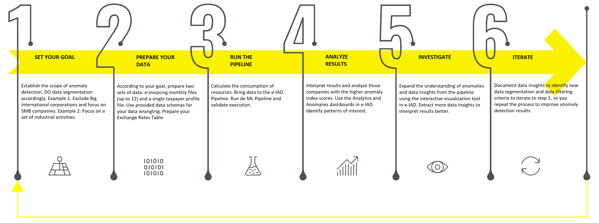

# Power BI user interface

In this section we cover the Power Bi report, its features and how it functions. This is the default front end user interface for visualizing and exploring the output of the Synapse pipelines.

## Customizations

To change or expand upon the report visuals, install the Power Bi Desktop tool from this [page](https://apps.microsoft.com/store/detail/power-bi-desktop/9ntxr16hnw1t). Open a local copy of the report in this desktop application and make any changes. Once complete, the report can be published to the central Power Bi workspace, where the changes will be available to the wider user group.

## Navigation

In the image below, you can see the stages of the overall e-IAD process

The report includes a large number of pages, but without some way of aligning these reports to the stages shown in the image above, they would lose that context and be difficult to navigate. To address this we included a navigation capability to group report pages. This is enabled by two features in Power BI. Firstly a feature known as 'selection', which allows us to group visuals on a report page and selectively show or hide elements. Secondly by a feature known as 'bookmarks', which captures a snapshot of a selection, with visuals hidden or shown. Combining these two capabilities allow us to navigate to a bookmark when a user clicks on a button in the report.

## Accessing underlying data

The most common pattern for accessing data in Power BI is known as import, where a snapshot of a scope of data such as a SQL table, is ingested into Power BI. This 'copy' allows the designer to perform deep transformations on the data prior to visualization. The downsides of this approach are firstly that the ingested data copy is disconnected from the live data source, and so there is a delay between data being available and that data being loaded to Power BI. Secondly there are limits on the size of datasets that can be ingested. For e-IAD we determined that size of datasets and that we wanted access to data from various pipeline runs, would mean we would need to use an alternate method known as Direct Query.

This approach allows us to 'query' underlying data on demand when a visual needs to be refreshed. The downside of this approach is that we are limited in the complexity of transformations we can perform, as these transformations need to me converted to a query.

## Batch selection

Using Direct Query, we connect to the serverless SQL instance exposed via Synapse, and select tables that we wish to include in visuals. These SQL tables in Synapse are prefixed with the batch run ID. To structure the name of the table we are querying, we make use of a 'parameter' in Power Bi which has the value of the batch id we wish to view. This parameter is connected to the batch id selection component on the home page.

## Visuals

In the report we make use of 1st party Microsoft visuals, such as the slicer, table, scatter chart etc. For extensions of the report, you can select 'Get more visuals options' which presents a market place of visuals from 3rd parties as well as additional visuals from Microsoft. In the e-IAD report we have imported and used some of these marketpace based Microsoft visuals, including Sanddance, the text filter and Sunburst.