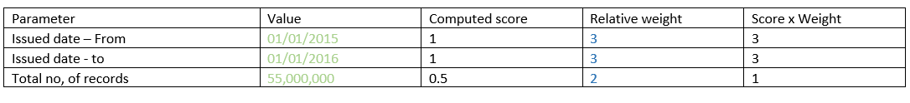
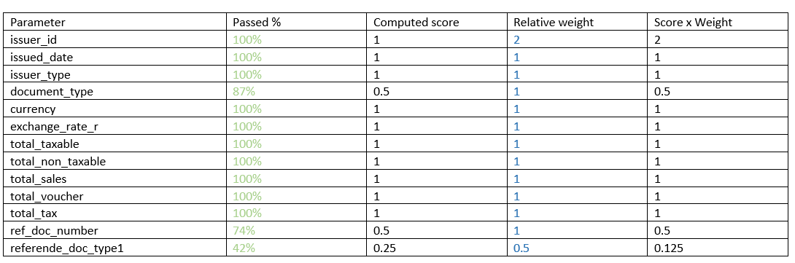
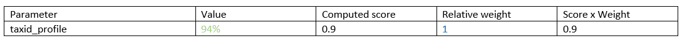

# Data Quality Index

## Objective and key definitions

The purpose of defining a Data Quality index is to measure and control the quality of incoming data consignments that would be picked up by the pipeline. The measuring and control aspect will evolve as we learn more about the behaviour of the model as well as identified deficiencies that needs to be addressed in the data itself.  Once we control the quality of incoming data the focus can shift to optimising the rest of the pipeline and the AD model itself for best performance.

Data quality of datasets is a function of

- **Sample metrics** – reflects characteristics of the incoming consignment of data like date range of the invoices, volume of records – Sample Quality Index (**SQi**)
- **Completeness** – provides a measure of the presence of values in pre-defined mandatory fields including any validation of the field itself for range of values or other criteria -  Completeness index (**Ci**)
- **Relevant Cross References** – quantifies the proportion of e-invoices that have cross-referenced values on pre-specified secondary data sources – Cross Reference index (**xRefi**)

`Dqi = Average ( SQi +  Ci +  xRefi)`

In simple terms, the overall quality is computed as an average of all the three indices with the possibility of evolving this to a more sophisticated computation if so required.

## Sample Quality index

Criteria : key areas we want to quantify and measure the quality of the incoming data consignment.

### SQi Calculation Variables

Calculation variables for the Sample Quality Metrics are summarized in the following table:

Field  |Type  |Description
--|--|--|
min_date  |DateTime  |Minimum date and time value expected for the “issued_date” of the year of analysis, in the format dd/mm/yyyy hh:mm:ss. What is the minimum date in the period of analysis? What I expect.
max_date  |DateTime  |Maximum date and time value expected for the “issued_date” of the period of analysis, in the format dd/mm/yyyy hh:mm:ss. What is the maximum date in the period of analysis? What I expect.
issued_date_min  |DateTime  |Minimum date and time reported in the entire dataset for the “issued_date” in the format dd/mm/yyyy hh:mm:ss.
issued_date_max  |DateTime  |Maximum date and time reported in the entire dataset for the “issued_date” in the format dd/mm/yyyy hh:mm:ss.
num_recs  |Integer  |Total number of records in the e-Invoicing dataset.
pct_below_range  |Float  |Percentage of records where the issued_date is lower than the “min_date”
pct_above_range  |Float  |Percentage of records where the “issued_date” is bigger than the “max_date”
pct_in_range  |Float  |Percentage of records where the “issued_date” is between “min_date” and “max_date”

### SQi Relative Weights

Relative weights for calculated variables for the Sample Quality Metrics are summarized in the following table:

|Parameter  |Desired range  |Relative Weight  |
|--|--|--|
|SQi_below_range_weight  |1% < min_date  |3  |
|SQi_above_range_weight  |0.1% > max_date  |3  |
|SQi_in_range_weight  |98.9 % between min_data and max_date  |2  |

### SQi Scoring Methodology

This section introduces the calculation criteria for the different scores:

#### Calculation of the scoring for pct_below_range

|Condition: pct_below_range  |Score  |
|--|--|
|pct_below_range < 1%  |1  |
|pct_below_range > 1% but < 2%  |0.9  |
|pct_below_range > 2% but < 5%  |0.5  |
|pct_below_range > 5%  |0.25  |

#### Calculation of the scoring for pct_above_range

|Condition: pct_above_range  |Score  |
|--|--|
|pct_above_range < 0.1%  |1  |
|pct_above_range > 0.1% but < 0.5%  |0.9  |
|pct_above_range > 0.5% but < 1.5%  |0.5  |
|pct_above_range > 1.5%  |0.25  |

#### Calculation of the scoring for pct_in_range

|Condition: pct_in_range  |Score  |
|--|--|
|pct_in_range > 99.1%  |1  |
|pct_in_range > 97.5% but < 99.1%  |0.9  |
|pct_in_range > 93.5% but < 97.5%  |0.5  |
|pct_in_range < 93.5%  |0.25  |

`SQi = Average (Sigma (Parameter wt * score) / Max possible score`>> across all defined criteria

As an illustrative example to show how the calculation is carried out and assuming only 3 criteria for simplicity, refer the table and the calculation format below.

Average (Sigma (wt x score)) = 7/3 = 2.33

Maximum possible score = ((3x1) + (3x1) + (2x1))/3 = 2.66

**SQi** = 2.33/2.66 = 0.87

---

## Completeness index

Criteria : key mandatory fields we want to see populated and validated in the incoming data consignment. The values in blue are given only as examples and can be changed as required:

### Ci Calculation Variables

Calculation variables for the Completeness Index are summarized in the following table:

Field | Target Calculation
--|--
pct_null_issuer_id | Number of NULLs in issuer_id / total_records
pct_null_issued_date | Number of NULLs in issued_date / total_records
pct_null_issuer_type | Number of NULLs in issuer_type / total_records
pct_null_document_type |Number of NULLs in document_type / total_records
pct_null_currency |Number of NULLs in currency / total_records
pct_null_exchange_rate |Number of NULLs in exchange_rate_r / total_records
pct_null_total_taxable |Number of NULLs in total_taxable / total_records
pct_null_total_non_taxable |Number of NULLs in total_non_taxable / total_records
pct_null_total_sales |Number of NULLs in total_sales / total_records
pct_null_total_voucher |Number of NULLs in total_voucher / total_records
pct_null_total_tax |Number of NULLs in total_tax / total_records
pct_null_activity_issuer |Number of NULLs in activity_issuer / total_records
pct_null_document_id |Number of NULLs in document_id / total_records
pct_null_receiver_id |Number of NULLs in receiver_id / total_records
pct_null_total_discount |Number of NULLs in total_discounts / total_records

### Ci Relative Weights

Relative weights for calculated variables for the Completeness Index are summarized in the following table:

Field  |Desired Condition  |Weight Qi
--|--|--|
issuer_id  |NULLs not expected  |3  |
issued_date  |NULLs not expected  |3  |
document_id  |NULLs not expected  |3  |
issuer_type  |NULLs not expected  |2  |
document_type  |NULLs not expected  |2  |
currency  |NULLs not expected  |2  |
exchange_rate  |NULLs not expected  |2  |
total_taxable  |NULLs not expected  |2  |
total_non_taxable  |NULLs not expected  |2  |
total_sales  |NULLs not expected  |2  |
total_voucher  |NULLs not expected  |2  |
total_tax  |NULLs not expected  |2  |
activity_issuer  |NULLs not expected  |2  |
receiver_id  |NULLs not expected  |2  |
total_discount  |NULLs not expected  |1  |

### Ci Scoring Methodology

This section introduces the calculation criteria for the different scores:

|Condition for each parameter  |Score  |
|--|--|
|100% Completeness. No NULL values |1  |
|99% Completeness. NULL values <= 1% but > 0%  |0.9  |
|98% Completeness. NULL values <= 2% but > 1%  |0.5  |
|97% Completeness. NULL values <= 3% but > 2%  |0.25  |
|<97% Completeness. NULL values >3% | 0

`Ci = Average (Sigma (Parameter wt * score) / Max possible score`>> across all defined criteria parameters.

As an illustrative example, say we receive a sample dataset with the following values and the related computations against the key criteria:

Average (Sigma (Score x Weight)) = 12.125/13 = 0.932

Maximum possible score = 15.25/13 = 1.173

**Ci** = 0.932/1.173 = 0.795

---

## Cross Reference index

Criteria : The e-Invoicing dataset cross-references the taxpayer profile dataset through issuer_id. The Cross Reference index reflects the presence a referenced value in the taxpayer profile dataset for every issuer_id field present in the e-Invoicing dataset

### xRefi Calculation Variables

Calculation variables for the Cross Reference Index are summarized in the following table:

Field  |Type  |Description
|--|--|--|
|issuer_id_no_taxpayer_id  |FloatType  |Percentage of unique issuer_id records in the e-Invoicing dataset not existing as taxpayer_id in the taxpayer_profile dataset

### xRefi Relative Weights

Relative weights for calculated variables for the Cross-Reference Index are summarized in the following table:  

|Field  |Desired Condition  |Weight Qi  |
|--|--|--|
|issuer_id_no_taxpayer_id  |100% of issuer_id records in the e-Invoicing dataset exist as taxpayer_id records in the taxpayer_profile dataset  |3  |

### xRefi Scoring Methodology

This section introduces the calculation criteria for the different scores:

|Condition - Cross-reference validation passed  |Score  |
|--|--|
|100% Cross-referenced |1  |
|> 99% but < 100% |0.9  |
|> 98% but < 99%  |0.5  |
|< 98% |0.25  |

`xRefi = Average (Sigma (Parameter wt * score) / Max possible score`>> across all defined cross reference data sources

As an illustrative example, say we receive a sample dataset that scores as follows against the cross reference criteria:

Average (Sigma (wt x score)) = 0.9/1 = 0.9

Maximum possible score = ((1 x 1) = 1.00

**xRefi** = 0.9/1.0 = 0.9

---

## Overall Quality Index Calculation

**Overall Data Quality Index (DQi)** is defined as the average of all the three scores : Average (SQi, Ci, xRefi)

Therefore, for the examples above :

**DQi** = Average (0.87, 0.795, 0.9) = 0.855 which is approx. 85%
