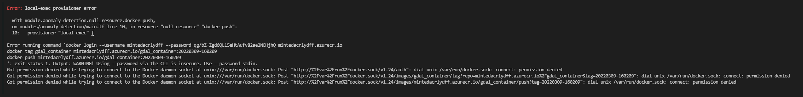
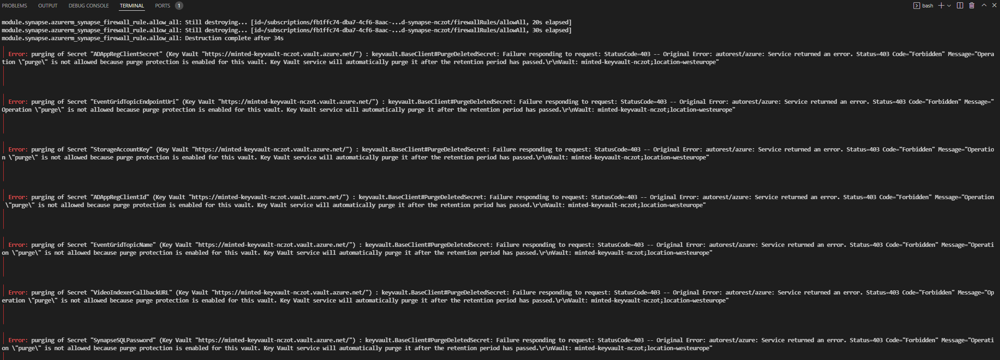
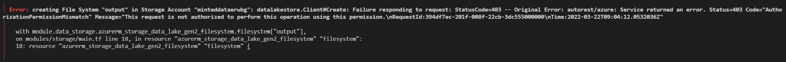

# Known Issues

## Docker: Got permission denied while trying to connect to the Docker daemon socket

Got permission denied while trying to connect to the Docker daemon socket at ...

### Solution

Run the following command:

`$ sudo chmod 666 /var/run/docker.sock`

---

## Azure Key Vault - During make deploy error purging of Secret

This error is because you may be reusing an already used resource group name and Key Vault cannot delete the old keys.

### Solution

In your local.env file, use a new resource group name which is new and unique from previous ones or other possible used ones in the Subscription.

`export WORKSPACE="<put something new here>"`

---

## Error: autorest/azure: Service returned an error. Status=403 Code="AuthorizationPermissionMismatch" Message="This request is not authorized to perform this operation using this permission"

### Solution

Assign "Storage Blob Data Contributor" role on the storage account created by eIAD with the name like "eiaddataxxxxx" to the user performing the deployment

---
