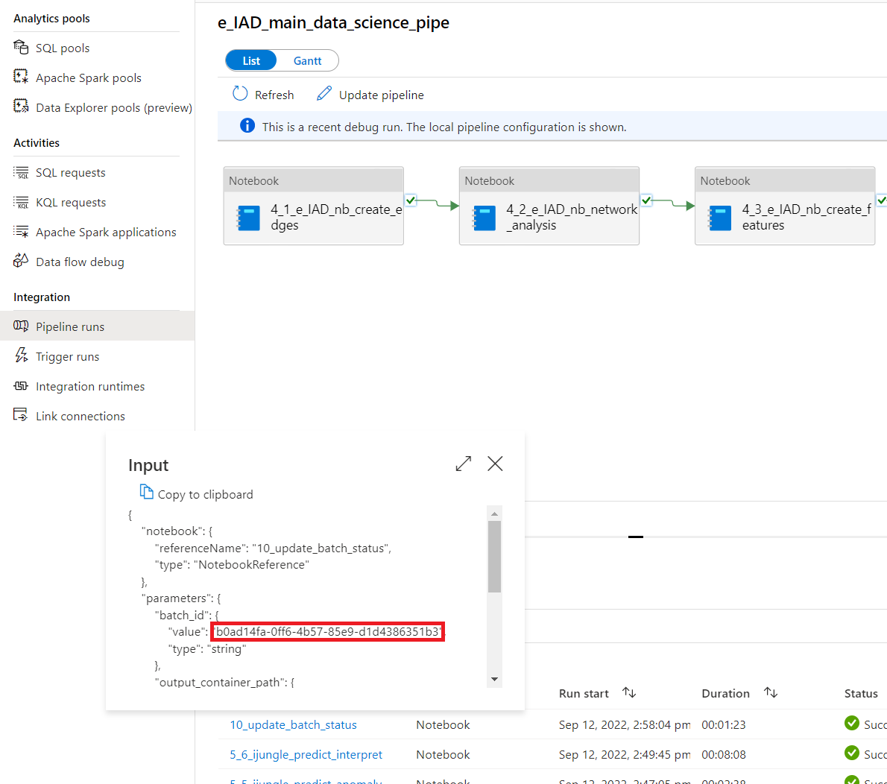

# Power BI configuration

In this section we cover how to deploy and configure the Power Bi report, which is the default user interface for visualizing and exploring the e-IAD Accelerator output data.

## Retrieve configuration values

Before you can deploy, you must have successfully completed an end to end batch run through the Synapse pipelines. Once this criteria is met, copy and save the following values from your Azure environment as they will be required during deployment.

1. **Batch_id.** The batch id of your run can be copied by opening the Synapse Studio from the Synapse Workspace in Azure Portal and selecting Monitor from the left menu bar. Then select Pipeline Runs and then Triggered. Adjust the time period if your run was more that 24 hours prior, and then select the pipeline named "e_IAD_main_data_science_pipe" as shown in the image below.

When the page opens showing the main data science pipeline execution history, select the input icon on the "10_update_batch_status" activity which will show you the input values for this stage.

The first item shown under the parameters section is batch_id. Copy this value.

2. **Serverless SQL Endpoint.** Next, Open your resource group in Azure and then open the Synapse Workspace and copy and save the Serverless SQL Endpoint. The location of this value is shown below

3. **Database.** The default value is "eiad". If this was modified during deployment, it can be found by opening Synapse Studio, selecting 'Data' from the left menu bar, expanding 'SQL Database' under the 'Workspace' group and verifying the database name as shown below.

4. **Storage Account.** Open your resource group in Azure Portal and copy and save the name of the resource with the type of "Storage Account".

5. **Resource Group.** The next value you will need to copy and save is the name of the resource group to which your services were deployed.
6. **Subscription ID.** Your Azure Subscription ID can be found by opening the resource group in Azure Portal and copying the value from the Overview blade. 

7. **Log Analytics Workspace.** Open your resource group in Azure Portal and select the resource with the type of "Log Analytics workspace". On the overview page, copy the Workspace ID. 

## Create a Power BI workspace

If you do not have an existing Power BI workspace to publish to you will need to create one. To do this navigate to [https://www.powerbi.com/](https://www.powerbi.com/) and select 'Workspaces' from the left menu bar and then select 'Create a workspace'.

## Configure the report

Now you have all the required values to connect your Power BI report to the Azure resources.

>1. Open the report template file, [iEAD_Report.pbit](iEAD_Report.pbit), in Power BI Desktop.
>2. You will be presented with a box where you can input the values you saved earlier. This will be used to connect your report to the Azure resources.
>
>3. Once you have entered all the values click 'Load'. (This can take a minute or two to load.)
>4. Once the report fully populates, you will need to publish the report to you Power BI workspace. This will allow the report to be opened by authorized users and potentially embedded in existing applications.
>5. To publish the report open the File menu and select 'Publish' and then 'Publish to Power BI'
>
>6. You will then be asked to save your new report. (*The reason for this is because you opened a template file. From this template you have created your own report and configured it with the required values.*
**IMPORTANT:** The name you save the file as will be the name that appears in your Power BI Workspace for the report.
>7. After the file saves, you will be presented with a dialog box asking you to select which Power BI workspace you would like to publish this report to. Select the workspace you created by typing its name in the box. Click Publish.
>8. You will then be presented with a message indicating the report was published successfully, as shown below. You can click on the link to navigate to the report in your Power Bi workspace.

## Sharing the report

Once published, from the web page that opens your report in the Power BI workspace, you can select File > Embed report > Website or portal. Copy the top link that is shown and share this with people who need to access the report

## Update credentials for manual or scheduled refreshes

You will need to provide credentials to the report to access the Azure resources you pointed the report to from the Power BI workspace.

>1. To do this open the Power Bi Portal and select 'Workspaces' from the left menu bar and then enter the name of the workspace you published the report to.
>2. You will then be presented with a page showing the reports and datasets that were created when you published your report to the workspace.
>3. Select the menu option on the dataset with the same name as your report and select the "Settings" option as shown below.

>4. The next page will allow you to enter, or update the credentials used to access the Azure Resources. You need to enter credentials for both the Kusto and Azure Serverless SQL connections. Select the OAuth2 option for both of these.

---

At this point this step is complete, please return to the [checklist](../README.md) and complete the next step.
